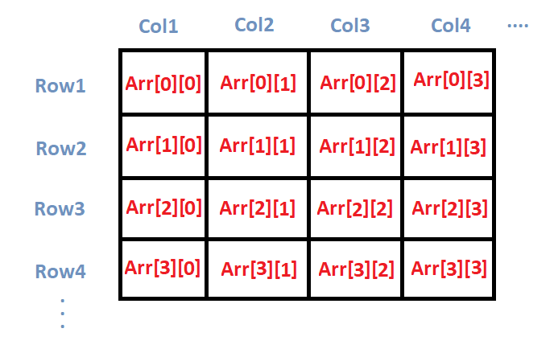
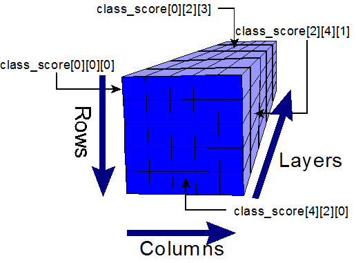

# Array

## What is an array ?

An array is an abstract data type, meaning its underlying implementation can change based on what programming language you use, however it follows a set of rules that are consistent through most programming languages.

This is a key idea to understand, as once you understand the fundamentals of what an array is, what operations it typically supports and when its used, are you able to implement it and use it effectively.

### Definition of an array

An array stores a collection of elements that have the same data type.

### Properties of an array

* Continuous block of memory
* Fixed size
* All elements have the same data type
* Each element is indexed

### Operations of an array

* Add an element to an array - O(N) time complexity
* Removing an element from an array - O(N) time complexity
* Accessing an element by index - O(1) time complexity&#x20;

| Operation | Time | Space |
| --------- | ---- | ----- |
| Access    | O(1) | O(1)  |
| Search    | O(N) | O(1)  |
| Insertion | O(N) | O(N)  |
| Deletion  | O(N) | O(N)  |

### Diagram of an array


## Visual flow of operations

Here there will be a visual representation of what happens in most common operations for an array.

### Search for a element in an array























### Accessing a index from an array















### Insertion of a element into an array
















## Code


```csharp
// Here i create an array instaces of numbers with the size of 3
int[] numbers = new int[3];

// Here i assign the value at indx 0,1,2 the numbers 1,2,3
numbers[0] = 1;
numbers[1] = 2;
numbers[2] = 3;

// Here i loop through the array until i find the number 3 which returns true
bool doseNumberThreeExistsInArray = numbers.Contains(3);

// Re-assign the value at that index to be 4
numbers[2] = 4;

// Here i loop through the array until i find the number 3 which returns false
bool isThree = numbers.Contains(3);
```


## Variants

More topics worth knowing and understanding relating to arrays

### Multidimensional Arrays

A multidimensional array is an array that contains other arrays

#### 2D Arrays

A 2D array is an array of arrays, like a table with rows and columns

<figure><figcaption><p>2D Array</p></figcaption></figure>

#### 3D Arrays

A 3D array is an array of 2D arrays

<figure><figcaption><p>3D Array</p></figcaption></figure>

### Use cases

* Spatial grids like chess boards
* Image pixels (2D grid of color values)
* 3D volumetric data

### Code


```csharp
// This is a 2D array
int[,] array2DDeclaration = new int[4, 2];

// This is a 3D array
int[,,] array3DDeclaration = new int[4, 2, 3];
```

