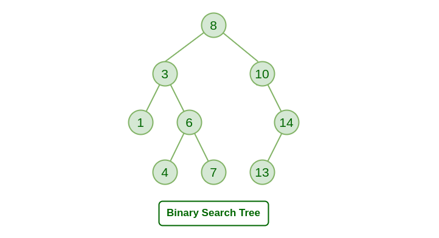

# Binary Search Trees

## What is a Binary Search Tree

A Binary Search Tree is an abstract data type, meaning its underlying implementation can change based on what programming language you use, however it follows a set of rules that are consistent through most programming languages.

This is a key idea to understand, as once you understand the fundamentals of what a Binary Search Tree is, what operations it typically supports and when its used, are you able to implement it and use it effectively.

### Definition of a Binary Search Tree

Set of nodes linked together, there is only one path linking two nodes together and no cycles exist, each node has at most two children, every node in the left subtree is less than the root, and every node in the right subtree is of a value greater than the root.

### Properties of a Binary Search Tree

* Maximum of two children per node
* Has a root node
* Contains nodes
* N - 1 edges
* Left subtree < root < Right subtree

### Operations of a Binary Search Tree

* Search the graph - O(logN) time complexity&#x20;
* Add items to the graph - O(logN) time complexity&#x20;
* Remove items from the graph - O(logN) time complexity&#x20;

### Diagram of a Binary Search Tree

<figure><figcaption></figcaption></figure>

## Visual flow of operations for a Binary Search Tree

### Insertion into a Binary Search Tree

Start at the root and compare the value to the nodes value, if greater place in right subtree, if less then left subtree continue until you can place it in a space.

<figure><figcaption></figcaption></figure>

### Deletion into a Binary Search Tree

Start at the root and compare the value to the nodes value, if greater go into the right subtree, if less then left subtree continue until you find and delete the node.

<figure><figcaption></figcaption></figure>

### Search into a Binary Search Tree

Start at the root and compare the value to the nodes value, if greater go into the right subtree, if less then left subtree continue until you find the node.

<figure><figcaption></figcaption></figure>

## Code

```csharp
// Binary Search tree

class Node
{
    public int data;
    public Node left, right;

    public Node(int data)
    {
        this.data = data;
        left = right = null;
    }
}

class BinarySearchTree
{
    private Node root; 

    public BinarySearchTree()
    {
        root = null;
    }

    // Insert a value into the BST
    public void Insert(int data)
    {
        root = InsertRecursive(root, data);
    }

    private Node InsertRecursive(Node current, int data)
    {
        if (current == null)
        {
            return new Node(data);
        }

        if (data < current.data)
        {
            current.left = InsertRecursive(current.left, data);
        }
        else if (data > current.data)
        {
            current.right = InsertRecursive(current.right, data);
        }

        return current; 
    }

    // Search for a value in the BST
    public bool Search(int data)
    {
        return SearchRecursive(root, data);
    }

    private bool SearchRecursive(Node current, int data)
    {
        if (current == null)
        {
            return false;
        }
        if (current.data == data)
        {
            return true; 
        }

        if (data < current.data)
        {
            return SearchRecursive(current.left, data);
        }
        else 
        {
            return SearchRecursive(current.right, data);
        }
    }
}


```

### Use cases&#x20;

* Implementing heaps (priority queues).
* Essential for maintaining efficient search, insertion, and deletion operations in data structures where speed is crucial (logarithmic time complexity).
