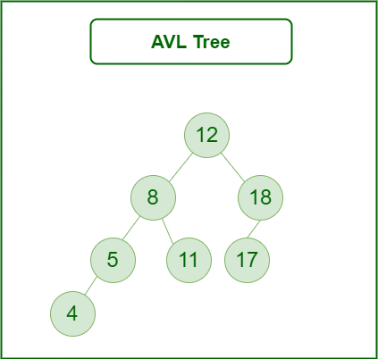
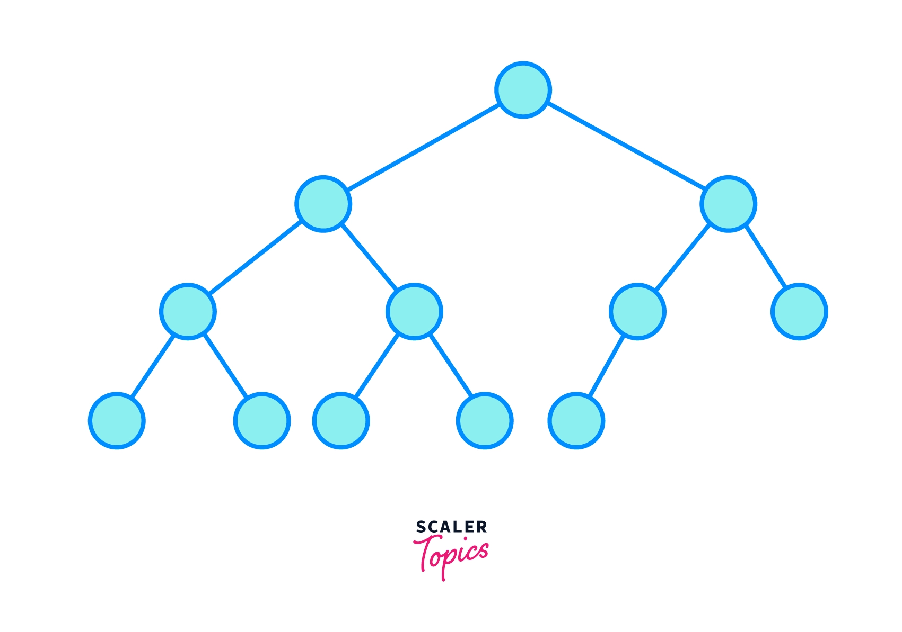

# Binary Trees

## What is a Binary Tree

A Binary Tree is an abstract data type, meaning its underlying implementation can change based on what programming language you use, however it follows a set of rules that are consistent through most programming languages.

This is a key idea to understand, as once you understand the fundamentals of what a Binary Tree is, what operations it typically supports and when its used, are you able to implement it and use it effectively.

### Definition of a Binary Tree

set of nodes linked together, there is only one path linking two nodes together and no cycles exist, each node has at most two children.

### Properties of a Binary Tree

* Maximum of two children per node
* Has a root node
* Contains nodes
* N - 1 edges

### Operations of a Binary Tree

* Search the graph - O(logN) time complexity&#x20;
* Add items to the graph - O(logN) time complexity&#x20;
* Remove items from the graph - O(logN) time complexity&#x20;

### Diagram of a Binary Tree


## Visual flow of operations for a Binary Tree

This really depends on what typeof binary tree you have like a binary search tree or other variant of it. But here is an example with a simple [binary search tree](binary-search-trees.md), this follows the rules of a binary tree but has some extra rules, you can have a min or max binary tree, these just mean that we order the numbers in ascending or descending order in the tree, and the rule of a binary tree is that the value on the left is less than that on the right.

### Insertion into a Binary Search Tree

<figure><figcaption></figcaption></figure>

### Deletion in a Binary Search Tree

<figure><figcaption></figcaption></figure>

### Other resources

* Use this interactive website for tree related graph visualization it helps you understand the creation, inseration, deletion and traversal of many tree [link](https://www.cs.usfca.edu/\~galles/visualization/BST.html).

## Code

```csharp
// Binary Search tree

class Node
{
    public int data;
    public Node left, right;

    public Node(int data)
    {
        this.data = data;
        left = right = null;
    }
}

class BinarySearchTree
{
    private Node root; 

    public BinarySearchTree()
    {
        root = null;
    }

    // Insert a value into the BST
    public void Insert(int data)
    {
        root = InsertRecursive(root, data);
    }

    private Node InsertRecursive(Node current, int data)
    {
        if (current == null)
        {
            return new Node(data);
        }

        if (data < current.data)
        {
            current.left = InsertRecursive(current.left, data);
        }
        else if (data > current.data)
        {
            current.right = InsertRecursive(current.right, data);
        }

        return current; 
    }

    // Search for a value in the BST
    public bool Search(int data)
    {
        return SearchRecursive(root, data);
    }

    private bool SearchRecursive(Node current, int data)
    {
        if (current == null)
        {
            return false;
        }
        if (current.data == data)
        {
            return true; 
        }

        if (data < current.data)
        {
            return SearchRecursive(current.left, data);
        }
        else 
        {
            return SearchRecursive(current.right, data);
        }
    }
}


```

### Variants

### **Balanced Binary Tree**

The height difference between the left and right subtrees of any node is never more than 1. Examples include:

**AVL Tree:** The first self-balancing binary search tree&#x20;

<figure><figcaption></figcaption></figure>

**Red-Black Tree:** Widely used due to good worst-case performance guarantees.

### Complete Binary Tree

All levels are filled except possibly the last, and the last level has all nodes as far left as possible.

<figure><figcaption></figcaption></figure>

### Use cases&#x20;

* Implementing heaps (priority queues).
* Essential for maintaining efficient search, insertion, and deletion operations in data structures where speed is crucial (logarithmic time complexity).
