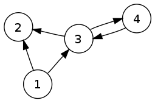
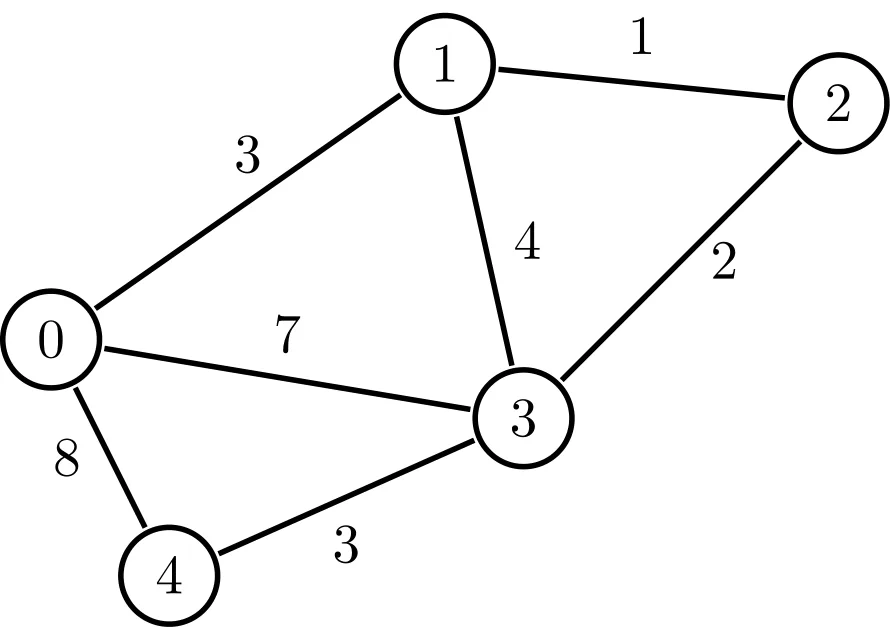
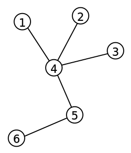

# Graphs

## What is a graph

A Graph is an abstract data type, meaning its underlying implementation can change based on what programming language you use, however it follows a set of rules that are consistent through most programming languages.

This is a key idea to understand, as once you understand the fundamentals of what a Graph  is, what operations it typically supports and when its used, are you able to implement it and use it effectively.

### Definition of a graph

Set of nodes connected by edges, a node is a specific data type that can hold references to other nodes its connected to.

### Properties of a graph

* Contains nodes
* Nodes can references other nodes its connected to
* Follow a specific graph shape or none

### Operations of a graph

* Search the graph - time complexity varies on the graph type
* Add items to the graph - time complexity varies on the graph type
* Remove items from the graph - time complexity varies on the graph type
* Restructure the graph - time complexity varies on the graph type

### Diagram of a graph


## Visual flow of operations

Here there will be a visual representation of what happens in most common operations for a graph.

### Adding an item to a graph

It really depends on what type of graph your dealing with but here is a common scenario



















### Searching for item in a graph

There are many algorithms out there for searching for a element in a graph however here i will just show a visual of what the most common scenario would be



















### Deleting an item from a graph

This depends on what type of graph you have and also which node your deleting but here is a common scenario&#x20;























## Code


```csharp
// Simple graph code
class Graph
{
    private int Vertices; // Number of nodes in the graph
    private Dictionary<int, List<int>> AdjacencyList;

    // Constructor
    public Graph(int vertices)
    {
        Vertices = vertices;
        AdjacencyList = new Dictionary<int, List<int>>();

        // Initialize empty adjacency lists for each node
        for (int i = 0; i < Vertices; ++i)
        {
            AdjacencyList.Add(i, new List<int>());
        }
    }

    // Function to add an edge
    public void AddEdge(int source, int destination)
    {
        AdjacencyList[source].Add(destination);

        // If it's undirected, add the opposite edge too 
        // (Commented out for directed graph example)
        // AdjacencyList[destination].Add(source);
    }

    // Helper for printing the graph representation
    public void PrintGraph()
    {
        foreach (var node in AdjacencyList)
        {
            Console.Write("Node " + node.Key + " has connections: ");
            foreach (var neighbor in node.Value)
            {
                Console.Write(neighbor + " ");
            }
            Console.WriteLine();
        }
    }
}

class Program
{
    static void Main(string[] args)
    {
        // Sample usage
        Graph graph = new Graph(4); // Create a graph with 4 nodes (0, 1, 2, 3)
        graph.AddEdge(0, 1);
        graph.AddEdge(0, 2);
        graph.AddEdge(1, 3);
        graph.AddEdge(2, 3);

        graph.PrintGraph(); 
    }
}

```


## Variants

### Directed Graph

Edges have a direction (one-way relationship). For example, a dependency graph where task A must precede task B.

<figure><figcaption></figcaption></figure>

### Undirected Graph

Edges have no direction (two-way relationship). Example: a map where roads connect cities without specifying one-way travel.

<figure><figcaption></figcaption></figure>

### **Weighted** Graphs

Edges have associated values (costs or weights). Example: a map where distances or travel times are indicated along roads.

<figure><figcaption></figcaption></figure>

### Tree

A hierarchical graph with a root node, branches, and leaves. No cycles. Example: File systems.

<figure><figcaption></figcaption></figure>

### Use cases

* Social Networks
* Recommendation Systems&#x20;
* Route Planning and Navigation
* Fraud detection
