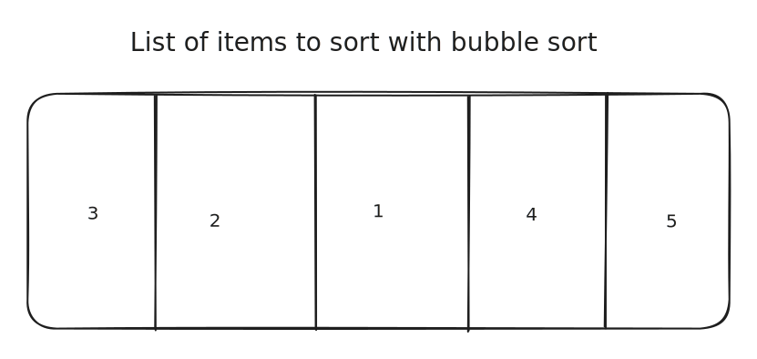

# Hash Tables

## What is a hash table

A Hash Table is an abstract data type, meaning its underlying implementation can change based on what programming language you use, however it follows a set of rules that are consistent through most programming languages.

This is a key idea to understand, as once you understand the fundamentals of what a Hash Table is, what operations it typically supports and when its used, are you able to implement it and use it effectively.

### Definition of a hash table

A key value pair container of data

### Properties of a hash table

* Each key must be unique&#x20;
* Multiple unique keys can have the same values
* Keys are hashed

### Operations of a hash table

* Adding keys / values- O(1) time complexity
* Removing a key / values -  O(1) time complexity
* Searching a key - O(1) time complexity

| Operation | Time | Space |
| --------- | ---- | ----- |
| Insert    | O(1) | O(N)  |
| Search    | O(1) | O(N)  |
| Delete    | O(1) | O(N)  |

### Diagram of a hash table


## Visual flow of operations

Here there will be a visual representation of what happens in most common operations for a hash table.

### Adding an item to a hash table























### Searching for an item in a hash table



















### Removing an item from a hash table



















## Code


```csharp
// Hash Table

// In c# we use a Dictionary as the hash table

// We create a number string key value pair 
Dictionary<int,string> numbersToWords = new Dictionary<int,string>();

// Adding key value pairs
numbersToWords[1] = "One";
numbersToWords[2] = "Two";
numbersToWords[3] = "Three";

// The hash table has key value pairs (1, "One"), (2, "Two"), (3, "Three")

// Searching for a given key

if(numbersToWords.ContainsKey(1)){
// It contains a key with value 1
}

// Compare a keys value

if(numbersToWords[1] == "One"){
// Then the value at key 1 is "One"
}

numbersToWords.Remove(1); // Removes key value pair

// The hash table has key value pairs (2, "Two"), (3, "Three")
```


## Variants

### Implamenation

Most other types have the same functionality as the base hash table however they differ under the hood, sometimes when you try to place an item in the table it collides with another after hashing, most alternatives try to solve this collision in other ways such as open addressing, multi mapping and more.

### Use cases

* Associative arrays/dictionaries
* Database indexing
* Caches
* Packet routing
