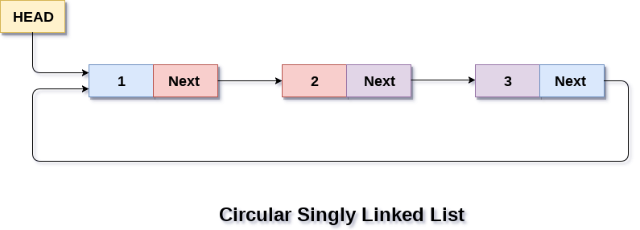

# Linked Lists

## What is a linked list

A linked list is an abstract data type, meaning its underlying implementation can change based on what programming language you use, however it follows a set of rules that are consistent through most programming languages.

This is a key idea to understand, as once you understand the fundamentals of what an linked list is, what operations it typically supports and when its used, are you able to implement it and use it effectively.

### Definition of a linked list

A linked list stores elements of the same data type in nodes, that are sequential, and point to the next node in the sequence.

### Properties of a linked list

* Scattered memory address for each node
* Nodes contain data and a pointer to the next node
* The end of a linked list is null
* All elements have the same data type

### Operations of a linked list

* Adding a element to a linked list - O(N) time complexity
* Removing a element from a linked list - O(N) time complexity
* Searching a linked list - O(N) time complexity

| Operation | Time | Space  |
| --------- | ---- | ------ |
| Search    | O(N) | O(1)   |
| Insertion | O(N) | O(1)   |
| Deletion  | O(N) | O(1)   |

### Diagram of a linked list


## Visual flow of operations

Here there will be a visual representation of what happens in most common operations for an linked list.

### Searching for a element in a linked list







Step 2













### Inserting a element into a linked list&#x20;



























### Deleting a element from a linked list























Step 6





## Code


```csharp
// Linked list code example in c#

public class LinkedList
{
    // We allways keep a reference to the head
    private Node? head;

    // Create the node class which has a next and data
    public class Node(int d)
    {
        public int data = d;
        public Node? next = null;
    }

    // Create the method to add node to the begining of the linked list
    public void AddFirst(int data)
    {
        // Create the node we are going to add
        Node newNode = new(data)
        {
            // Assign the nodes next pointer to point at the head
            next = head
        };

        // Here we update the head to be the new node we made, as its the new first node in sequence 
        head = newNode;
    }
    // Create a method to add a node to the end of a linked list
    public void AddLast(int data)
    {
        // Create the node
        Node newNode = new(data);

        // If there is no nodes or we are at the end we set the head to the new node
        if (head == null)
        {
            head = newNode;
            return;
        }

        // Keep a reference to the head node for traversal 
        Node current = head;

        // While we have not reached the tail which is null
        while(current.next != null)
        {
            // We keep on moving to the next node and keeping a reference to it
            current = current.next;
        }

        // Here we reached the end and then say the last nodes pointer next becomes this node
        current.next = newNode;

    }
}
```


## Variants

More topics worth knowing and understanding relating to linked lists

### Doubly linked lists

A node contains a pointer to both the next and previous node

<figure><figcaption><p>Doubly linked list</p></figcaption></figure>

### Circular  linked list

The last node points back to the first node

<figure><figcaption><p>Circular linked list</p></figcaption></figure>

### Use cases

* Implementing queue and stack data structures
* Dynamic memory allocation
* Circular buffers and some recursive algorithms
