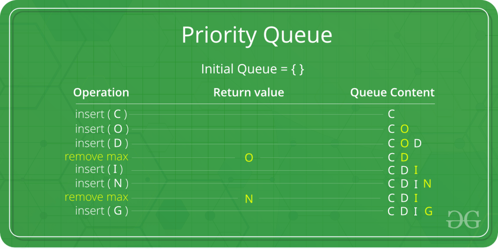

# Queues

## What is a queue ?

A queue is an abstract data type, meaning its underlying implementation can change based on what programming language you use, however it follows a set of rules that are consistent through most programming languages.

This is a key idea to understand, as once you understand the fundamentals of what an queue is, what operations it typically supports and when its used, are you able to implement it and use it effectively.

### Definition of a queue

A First In First Out container of data

### Properties of a queue

* Follows the convention of a real life queue
* First in first out
* Join the queue (Enqueue)
* Leave the queue (Dequeue)

### Operations of a queue

* Enqueue an item - O(1) time complexity
* Dequeue an item - O(1) time complexity
* Peek the first item - O(1) time complexity

| Operation        | Time | Space |
| ---------------- | ---- | ----- |
| Enqueue (Insert) | O(1) | O(1)  |
| Dequeue (Delete) | O(1) | O(1)  |
| Peek (Access)    | O(1) | O(1)  |

### Diagram of a queue


## Visual flow of operations

Here there will be a visual representation of what happens in most common operations for a queue.

### Adding an item to a queue

Also know as Enqueuing























### Deleting an item from a queue

Also known as Dequeuing











### Peeking an item from a queue











## Code


```csharp
// Queue code

// Start with an empty queue
Queue<int> numbersQueue = new Queue<int>();

// Adding item to the queue
numbersQueue.Enqueue(1);
numbersQueue.Enqueue(2);
numbersQueue.Enqueue(3);

// Queue numbers - 1,2,3

numbersQueue.Peek(); // returns 1

numbersQueue.Dequeue(); // return 1 and also removes it from the queue

// Queue numbers - 2,3

numbersQueue.Dequeue(); // return 2 and also removes it from the queue
numbersQueue.Dequeue(); // return 3 and also removes it from the queue

// Queue is empty
```


## Variants

More topics worth knowing and understanding relating to queues

### Priority Queue

A regular queue but with priority on each element, meaning if one item has a higher priority than another then it will be the first to come out.&#x20;

<figure><figcaption><p>Priority Queue Visual</p></figcaption></figure>

### Use cases

* Job/task scheduling
* Messaging
* Load balancing
* Emergency room
