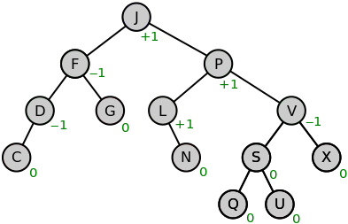
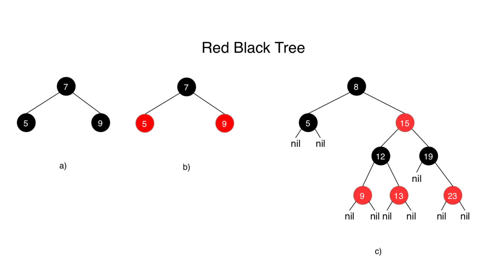

# Trees

## What is a Tree

A Tree is an abstract data type, meaning its underlying implementation can change based on what programming language you use, however it follows a set of rules that are consistent through most programming languages.

This is a key idea to understand, as once you understand the fundamentals of what a Tree is, what operations it typically supports and when its used, are you able to implement it and use it effectively.

### Definition of a Tree

Set of nodes linked together, there is only one path linking two nodes together and no cycles exist.

### Properties of a Tree

* Contains Nodes
* No Cycles between nodes&#x20;
* Single root node
* Number of edges is N - 1

### Operations of a Tree

* Search the graph - time complexity varies on the graph type
* Add items to the graph - time complexity varies on the graph type
* Remove items from the graph - time complexity varies on the graph type
* Restructure the graph - time complexity varies on the graph type

### Diagram of a Tree


## Visual flow of operations

Here there will be a visual representation of what happens in most common operations for a tree

### Adding an item to a tree

It really depends on what type of tree your dealing with but here is a common scenario



















### Deleting a node

When deleting it can vary depending on what type of tree data structure you have and also if it has children but here is a simple visual



















## Code

```csharp
// Tree example

// Create the root node
TreeNode<string> root = new("Animals");

// Create child nodes
TreeNode<string> mammals = new TreeNode<string>("Mammals");
TreeNode<string> birds = new TreeNode<string>("Birds");

// Add child nodes to the root
root.Children.Add(mammals);
root.Children.Add(birds);

// Add more child nodes
mammals.Children.Add(new TreeNode<string>("Dog"));
mammals.Children.Add(new TreeNode<string>("Cat"));
birds.Children.Add(new TreeNode<string>("Eagle"));

static void PrintTree(TreeNode<string> node, int indent = 0)
{
    for (int i = 0; i < indent; i++)
    {
        Console.Write("  ");
    }

    Console.WriteLine("- " + node.Value);

    foreach (var child in node.Children)
    {
        PrintTree(child, indent + 1);
    }
}

PrintTree(root);

/*

Console output:

- Animals
  - Mammals
    - Dog
    - Cat
  - Birds
    - Eagle
    
*/

class TreeNode<T>
{
    public T Value { get; set; }
    public List<TreeNode<T>> Children { get; set; }

    public TreeNode(T value)
    {
        Value = value;
        Children = new List<TreeNode<T>>();
    }
}
```

## Variants

### **General Tree Variants**

* **N-ary Tree:** A generalization of the basic tree structure. Each node can have an arbitrary number of children (not limited to two). Used in situations where the number of children per node can vary or is unknown beforehand. Example: File system directories, where a folder can contain any number of files and subfolders.

### **Binary Tree Variants**

* **Binary Search Tree (BST):** Nodes are arranged in a specific order. For any node:
  * Values in its left subtree are less than its value.
  * Values in its right subtree are greater than its value. **Use Cases:** Efficient searching, sorting, and range queries.

<div data-full-width="false">

<figure><figcaption></figcaption></figure>

</div>

* **AVL Tree:** A self-balancing binary search tree. The heights of the two subtrees of any node differ by at most one. Ensures that search, insertion, and deletion operations remain relatively efficient (logarithmic time complexity).

<figure><figcaption></figcaption></figure>

* **Red-Black Tree:** Another type of self-balancing binary search tree. Uses the concept of node "colors" (red or black) to maintain balance. Also provides efficient search, insertion, and deletion.

<figure><figcaption></figcaption></figure>

### **Specialized Trees**

* **B-Tree:** Designed to work well with disk storage or situations where you have large amounts of data. Nodes in a B-Tree can have many children. Excellent for database indexes and file systems.
* **B+ Tree:** A variation of the B-Tree where all data is stored only in leaf nodes. Provides efficient sequential access of data.
* **Trie (Prefix Tree):** Used for storing strings in a way that allows efficient prefix-based searches. Applications include autocomplete suggestions and word lookups in dictionaries.
* **Segment Tree:** Specialized for storing intervals or segments. Allows efficient queries about which stored segments contain a given point. Used in computational geometry and database systems.

### **Factors to Consider When Choosing a Tree Variant:**

* **Number of children per node:** Do you need strict binary trees, or can nodes have multiple children?
* **Search efficiency:** Are fast searches a priority? If so, BSTs might be a good choice.
* **Data storage:** Are you working with disk storage? B-trees might be well-suited.
* **Balancing:** Do you need to maintain balance in the tree to guarantee efficient operations? If so, consider AVL or Red-Black trees.

## Use cases

### **General Trees**

* **Hierarchical Data Representation:**
  * File systems (folders and files)
  * Organization charts
  * Family trees
  * Website navigation structures
  * XML and HTML document structure (DOM)

### **Binary Trees**

* **Binary Search Trees (BSTs):**
  * Fast searching and sorting of data
  * Implementing sets and maps (key-value storage)
  * Range queries in databases
* **AVL Trees & Red-Black Trees:**
  * Same as BSTs, but they maintain balance for guaranteed efficiency in search, insertion, and deletion.
  * Used in database implementations and memory management.

### **Specialized Trees**

* **B-Trees & B+ Trees:**
  * Database indexing (very efficient for large datasets)
  * File systems designed for high-volume data storage.
* **Tries:**
  * Autocomplete and spell-checking in text editors and search engines
  * Implementing dictionaries
  * IP routing
* **Segment Trees:**
  * Range queries (finding the sum, minimum, maximum within a range in an array)
  * Applications in computational geometry

### **Other Use Cases**

* **Heap (Binary Tree Implementation):** Implementing priority queues used in task scheduling and shortest-path algorithms (e.g., Dijkstra's algorithm).
* **Syntax Trees:** In compilers, representing the grammatical structure of code.
* **Game Trees:** In Artificial Intelligence, modeling decision-making processes in games (e.g., chess, checkers).
