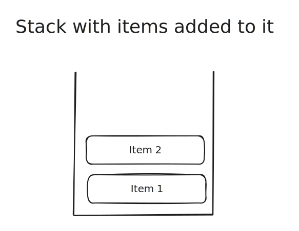

# Trees

## What is a Tree

A Tree is an abstract data type, meaning its underlying implementation can change based on what programming language you use, however it follows a set of rules that are consistent through most programming languages.

This is a key idea to understand, as once you understand the fundamentals of what a Tree is, what operations it typically supports and when its used, are you able to implement it and use it effectively.

### Definition of a Tree

Set of nodes linked together, there is only one path linking two nodes together and no cycles exist.

### Properties of a Tree

* Contains Nodes
* No Cycles between nodes&#x20;
* Single root node
* Number of edges is N - 1

### Operations of a Tree

* Search the graph - time complexity varies on the graph type
* Add items to the graph - time complexity varies on the graph type
* Remove items from the graph - time complexity varies on the graph type
* Restructure the graph - time complexity varies on the graph type

### Diagram of a Tree

## Visual flow of operations

Here there will be a visual representation of what happens in most common operations for a tree

### Adding an item to a tree

It really depends on what type of tree your dealing with but here is a common scenario



















### Deleting a node

When deleting it can vary depending on what type of tree data structure you have and also if it has children but here is a simple visual


















